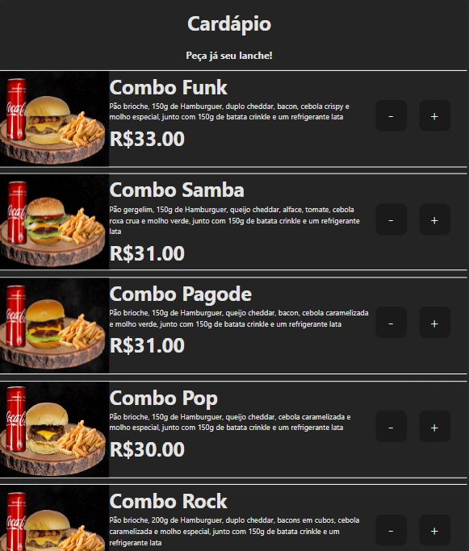
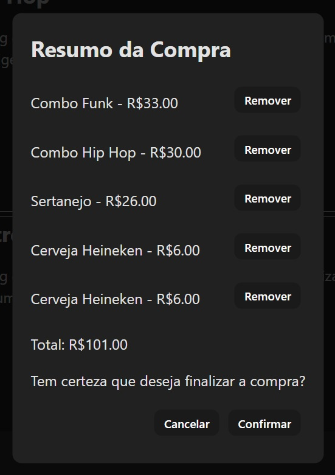

# CARDÁPIO ONLINE 

## Cardápio Online para Hamburgueria

Este projeto é um cardápio online desenvolvido para uma hamburgueria, permitindo aos clientes visualizarem os itens disponíveis, selecionarem os lanches desejados e realizarem seus pedidos de forma simples e conveniente.

### Funcionalidades Principais:

1. **Visualização do Cardápio:** Os clientes podem acessar uma página web que exibe o cardápio completo da hamburgueria, incluindo uma variedade de opções de lanches.

2. **Seleção de Itens:** Os clientes têm a capacidade de selecionar a quantidade de lanches.

3. **Carrinho de Compras:** Um carrinho de compras interativo permite que os clientes revisem os itens selecionados, removam ou adicionem mais produtos conforme necessário e visualizem o total do pedido.
   

5. **Envio de Pedido:** Após confirmar os itens no carrinho, os clientes podem enviar o pedido, o que gera automaticamente uma mensagem no WhatsApp direto para o numero cadastrado da Hamburguearia, onde continuará o processo de compra com um atendente.

### Tecnologias Utilizadas:

- **Frontend:** HTML, CSS, Javascript e Typescript.
- **Backend:** Java.
- **Frameworks**: SpringBoot.
- **Banco de Dados:** PostgreSQL.

### Como Usar:

1. Clone este repositório em sua máquina local.
2. Execute o servidor backend (se aplicável).
3. Abra o arquivo HTML principal em seu navegador web para acessar o cardápio online.

Sinta-se à vontade para personalizar e expandir essa descrição de acordo com os detalhes específicos do seu projeto.
